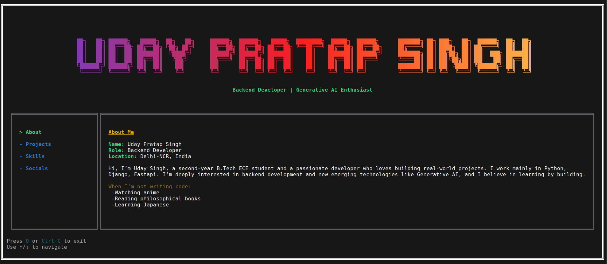

#  Terminal Based Portfolio

An **interactive, keyboard-driven CLI portfolio** built with **React and Ink**.  
Explore my profile, projects, skills, and contact details — all directly from your terminal.

---

## Screenshot




---

## Features

-  Interactive **Terminal UI (TUI)**
- Keyboard navigation (Arrow keys)
- Gradient text & ASCII banners
- Modular sections (About, Projects, Skills, Contact)


---

## Tech Stack

- **React** – UI logic
- **Ink** – React renderer for CLI
- **ink-gradient** – Gradient text effects
- **ink-big-text** – ASCII headers
- **Node.js**

---

## Project Structure

```text
cli-portfolio/
├── components/
│   ├── about.jsx
│   ├── projects.jsx
│   ├── skills.jsx
│   └── contact.jsx
├── assets/
│   └── screenshot.png
├── index.jsx
├── package.json
└── README.md
```

## Installation Instructions

Follow the steps below to install and set up locally.

---

### 1. Clone the Repository

```bash
git clone https://github.com/udaydevs/cli-portfolio.git
cd cli-portfolio
```

### 2. Install dependencies

```bash
npm install
```

### 3. Run the application

```bash
npm start
```
---

## Authors
 **Uday Pratap Singh**</br>
 Backend Developer | Tech Enthusiast


---
## Licence
- Copyright © 2026 Uday Pratap Singh
- This project is licensed under the MIT License
